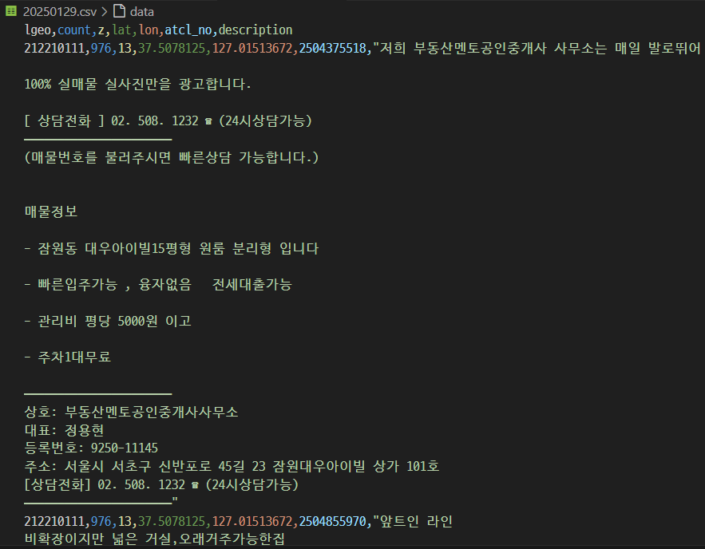

# realestate

## Why did i make this? 

- 버팀목 전세대출, 보증보험 가능한지 여부는 `매물특징` 에 적혀 있다
- 그 말은 즉, 모든 부동산 매물을 들어가서 `매물특징`을 찾아야 한다는 이야기
- 그리고 저장 된 데이터 (eg. 주차가능 여부, 전세, 가격대, 투룸) 가 초기화 되는 이슈

## How should i make it?

- 추출한 데이터는 `Excel or CSV` 로 저장
- 크롤링으로 하루에 한번 `서초구 투룸 전세` 데이터가 나온다면 그 데이터만 가져온다
- 청년전용 버팀목 전세 자금 대출 3억 대출 한도, 보증보험

## options

- tradTpCds = 전세 `&tradTpCd=B1`
- rletTpCds = 단독/다가구, 빌라 `&rletTpCd=DDDGG,VL`
- tag = `&tag=TWOROOM,PARKINGYN`
- TODO: 전세가
- TODO: 관리비
- TODO: 층수 
- TODO: 주소지 & 네이버 맵 바로가기

