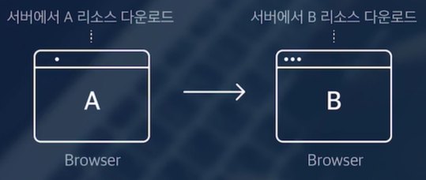
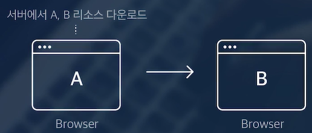

# realestate frontend

## 1강 React 란?

- 사용자 인터페이스를 만들기 위한 Javascript 라이브러리 (SPA 라이브러리)
- 웹 개발을 위한 라이브러리
  - `라이브러리`: 개발에 필요한 도구, 그 집합 전체
  - 프레임워크: 개발을 위한 기본 틀, 뼈대
- 왜 React 를 배워야 하는가?
  - 트렌드
    - 굉장히 많이 쓰이고 있음
    - 수요가 많음
    - 방대한 생태계
  - 편하다
    - SPA
    - 화면을 여러 단위로 쪼개고, 재사용하는 식으로 코드 관리가 용이함
    - 유용한 라이브러리들이 많음
- 어떻게 트렌드가 될 수 있었는가?
  - 전통적인 웹 서비스의 문제
  
    - 모든 페이지에 대한 네트워크 요청
    - 늘어나는 코드
  - SPA(Single Page Application) 방식 등장
  
    - 클라이언트(브라우저)에서 화면을 그리는 방식 
    - Javascript를 통해 HTML 생성
    - React, Vue, Angular 등

## 2강 React의 특징

- `컴포넌트 기반 설계`

  - 스스로 상태를 관리하는 캡슐화된 코드 조각 
    - 의미단위로 컴포넌트 구성
    - 재사용성과 유지보수성 증가
    - 부모, 자식 관계를 가짐
- `Virtual DOM (가상돔)`

  - 실제 DOM의 복사본으로 SPA에서의 동적인 변화를 효율적으로 관리하기 위해 사용됨
  - 가상돔에서 변경해두고 반영할 때는 DOM 에서 `동기화` 하는 방식
- CSR(Client Side Rendering)
  - 브라우저에서 화면을 랜더링 한다
- 풍부한 생태계
  - React Native
