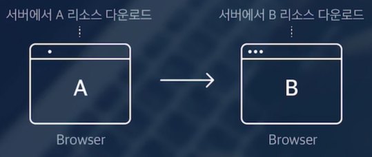
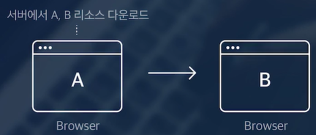

# 1강 React 란?

- 사용자 인터페이스를 만들기 위한 Javascript 라이브러리 (SPA 라이브러리)
- 웹 개발을 위한 라이브러리
  - `라이브러리`: 개발에 필요한 도구, 그 집합 전체
  - 프레임워크: 개발을 위한 기본 틀, 뼈대
- 왜 React 를 배워야 하는가?
  - 트렌드
    - 굉장히 많이 쓰이고 있음
    - 수요가 많음
    - 방대한 생태계
  - 편하다
    - SPA
    - 화면을 여러 단위로 쪼개고, 재사용하는 식으로 코드 관리가 용이함
    - 유용한 라이브러리들이 많음
- 어떻게 트렌드가 될 수 있었는가?
  - 전통적인 웹 서비스의 문제
  
    - 모든 페이지에 대한 네트워크 요청
    - 늘어나는 코드
  - SPA(Single Page Application) 방식 등장
  
    - 클라이언트(브라우저)에서 화면을 그리는 방식 
    - Javascript를 통해 HTML 생성
    - React, Vue, Angular 등

# 2강 React의 특징

- `컴포넌트 기반 설계`

  - 스스로 상태를 관리하는 캡슐화된 코드 조각 
    - 의미단위로 컴포넌트 구성
    - 재사용성과 유지보수성 증가
    - 부모, 자식 관계를 가짐
- `Virtual DOM (가상돔)`

  - 실제 DOM의 복사본으로 SPA에서의 동적인 변화를 효율적으로 관리하기 위해 사용됨
  - 가상돔에서 변경해두고 반영할 때는 DOM 에서 `동기화` 하는 방식
- CSR(Client Side Rendering)
  - 브라우저에서 화면을 랜더링 한다
- 풍부한 생태계
  - React Native

# 3강 JSX란?

```js
const element = <h1>Hello, world!</h1>;

// HTML
<button class="btn">Hello, world!</button>
<input type="text">

// JSX
<div>
    <button className="btn">Hello, world!</button>
    <input type="text" />  // 태그의 끝을 명시적으로
</div>
```

- JSX = HTML + Javascript
  - Javascript를 확장한 문법 (Javascript XML)
    - 모양은 HTML 에 가까움
    - 내부적으로 Javascript를 사용할 수 있음
    - React는 이 JSX를 이용하여 화면을 그림 (컴포넌트)
  - JSX의 특징
    - JSX에서 사용되는 태그의 속성 이름이 HTML과 조금 다름
      - class -> className
      - for -> htmlFor
      - onclick -> onClick
    - 태그를 명시적으로 닫아줘야 함
    - 하나의 태그로 감싸져 있어야 함

```js
import ReactDOM from 'react-dom';

const element = <h1>Hello, world</h1>; // JSX

ReactDOM.render(
    element,
    document.getElementById('root')
);
```

# 4강 JSX에서 Javascript 사용하기

```js
let text = "Hello, world";
const num = 3;
// const obj = {key: 1, value: 0}
// <li>{obj}</li> 에러 발생
const arr = [1, 2, 3];
const imageUrl = 'https://www.naver.com/';

const element = {
    <div>
        <h1>A</h1>
    </div>
}
```

# 5강 JSX에서의 조건문

```js
<h1>삼항연산자</h1>
{ 
    1 + 1 === 2
    ? '참 입니다.'
    : '거짓입니다.'
}
// 앞에 있는 값이 True 이면 && 뒤에 값을 보여주고, False 라면 빈 값 즉 조건문
<h1>AND 연산자</h1>
{1 + 1 === 2 && 'AND 연산자1'}
{arr.length && 'AND 연산자2'} // arr.length 가 1 이상이면
{!!arr.length && 'AND 연산자3'}  // !! 은 Boolean 타입으로 False, ! 은 Boolean 타입으로 True

// 앞에 있는 조건이 참이 되면 뒤에 있는 보지 않는다.
<h1>OR 연산자</h1>
{1 + 1 !== 2 || 'OR 연산자1'}
{text || 'OR 연산자2'}

// 자주 사용하지 않는다.
<h1>IF 문 즉시 실행함수</h1>
{(() => {
    if (1 + 1 === 2) return 'IF';
    else return 'ELSE';
})()}
```
# 6강 JSX에서의 반복문

- React 에서 `key` 는 동적인 리스트 요소를 효율적으로 업데이트하기 위해 필요합니다.
  - JSX 에서 하나의 독립적인 요소를 렌더링할 때는 `key`가 필요 없음

```js
const arr = ['10', '20', '30'];
const arr2 = []

for (let i = 0; i < arr.length; i++) {
  arr2.push(<h4 key={i}>{arr[i]}</h4>)
}

<h2>Array.map</h2>
<ul>
  <li>
    {arr.map((item, index) => {  // map() 을 이용해 리스트로 렌더링 할 때 key 가 필요하다.
      return <h4 key={index}>{item}</h4>
    })}
  </li>
</ul>
```

# 7강 JSX 스타일링

- CSS 적용하여 스타일링
  - CSS-in-JS

```js
{/* 1. style - Object 로 css 작성 */}
<div style={{
  position: 'relative',
  with: 400,
  height: 1000,
  background: '#f1f1f1'
}}> {/* 첫 번째 {} -> JSX 에서 Javascript 표현식을 사용 할 때 필요, 두 번째 {} -> Javascript 객체를 정의 */} 
  <div style={roundBoxStyle}>Hello 1</div> 

  <div style={{ ...roundBoxStyle, top: 350}}>
    <div className={"highlight"}>Hello 2</div>  {/* "highlight" 보다 {"highlight"} 하면 JSX 방식으로 사용 */} 
  </div>
  <div style={{ ...roundBoxStyle, top: 650}}>
    {/* 5. style - 조건적 스타일 */} 
    <div 
      className={
        1 + 1 === 2 ? 'highlight' : false  
        // 1 + 1 == 2 && 'highlight' : false
      } 
    > {/* 삼항연산자, 앞에 내용이 참이면 'highlight' 거짓이면 className을 false */} 
      Hello 3
    </div>
  </div> 
</div>

// 2. style 재활용
const roundBoxStyle = {
  position: 'absolute',
  top: 50,
  left: 50,
  width: '50%',
  height: '200px',
  padding: 20,
  background: 'rgba(162, 216, 235, 0.6)',
  // 3. style - 속성은 camelCase
  borderRadius: 50  // border-radius
}

// 3. App.css 사용
import './App.css'
```

